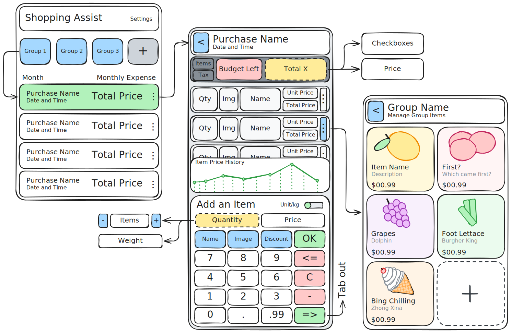

# Cart Operator


## Dev Snippets

On every DB change, run the following command:

```sh
dart run build_runner build
```

## Basic Requirements



### Settings Screen

Contains the following global settings:

- [ ] Set Currency Symbol
- [ ] Set Weight Unit (Metric, Imperial or Both)
- [ ] Set Tax Rate (0-100) for countries that display prices without tax

### Homepage Screen

- [x] Contains a list of purchases
- [x] Contains groups of purchases
- [x] CRUD purchase groups
- [x] CRUD purchase

### Other Screens

- [x] CRUD purchasedItems
- [ ] Settings
- [ ] CRUD items

### Purchases Screen

- [x] Contains a list of purchases in a group
- [x] Purchase item has these attributes:
  - string name
  - datetime purchase_datetime
  - ref tax_rate
  - total_price (calc)

### PurchasedItems Screen (Cart)

- [x] Contains a list of items in a purchase
- [x] CRUD PurchasedItems
- [x] PurchasedItems has these attributes:
  - string name
  - image photo
  - float discount
  - float quantity
  - float price

## Future Requirements

### Analytics

- [ ] Purchase history graph
- [ ] Price history graph for individual items
- [ ] Price history graph for all items timeline
- [ ] Monthly spend

### Imports and Exports

- [ ] Export to CSV
- [ ] Import from CSV
- [ ] Export to PDF

### QOL

- [ ] Item details autocompletion with Camera identification (tensorflow)
- [ ] Item duplication
- [ ] Item suggestions while typing based on history
- [ ] Easy price per item/quantity toggle
- [ ] Numpad type (top to bottom, bottom to top)
