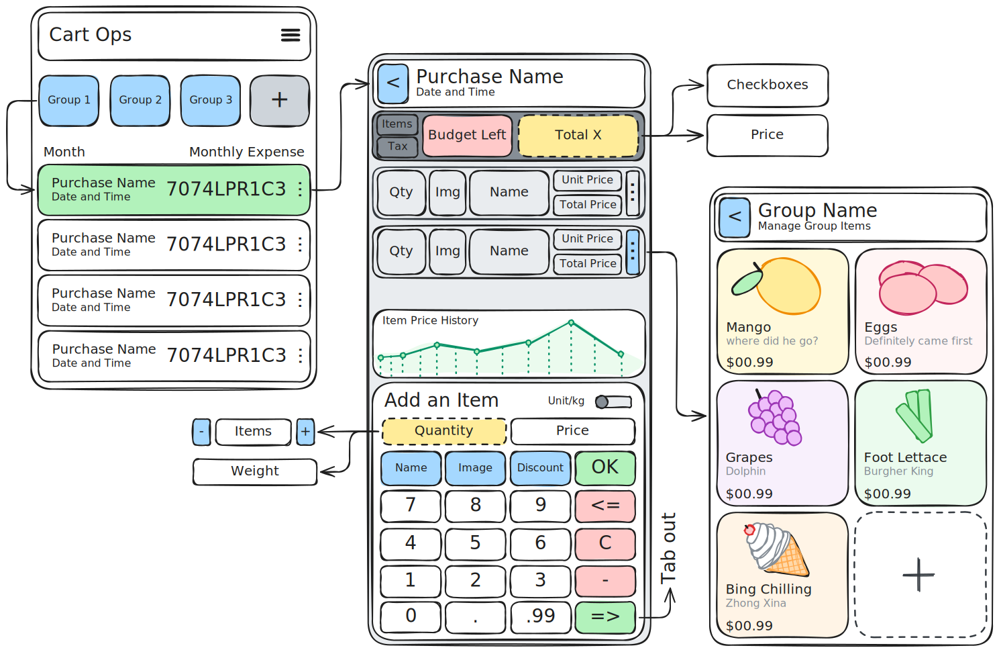

# Cart Ops

Personal commerce operator tool focusing on cognitive delegation of financial
resource management via technological assistance.


## Mission Objectives



### PHASE ALPHA: GENERAL OPERATIONS

#### Configuration Parameters

- [x] Globally Set Currency Symbol
- [x] Globally Set Theme Colors
- [x] Globally Set Weight Unit (Metric, Imperial or Both)
- [ ] Globally Set Tax Rate (0-100) for countries that display prices without tax

#### Core Operations

- [x] CRUD General purchases + Groups Screen
- [x] CRUD purchase Screen
- [x] Set per purchase budget
- [x] CRUD PurchasedItems Screen
- [x] CRUD reusable items

### PHASE BRAVO: OPERATOR QUALITY OF LIFE

- [x] Item details autocompletion while typing
- [x] ~Item Camera identification (tensorflow)~ Autocompletion works way too well for needing this
- [x] ~Item duplication~ Can be done quickly with autocompletion
- [x] Item suggestions while typing based on history
- [x] Easy price per item/quantity toggle
- [x] Core Numpad UI
- [x] Numpad Variant - Calculator (bottom to top)
- [x] Numpad Variant - Telephone (top to bottom)

### PHASE CHARLIE: ADVANCED OPERATIONS

#### Intelligence & Analytics

- [x] Purchase history
- [x] Price history for individual items
- [ ] Price history graph for individual items
- [ ] Price history graph for all items timeline
- [ ] Monthly spend

#### Data Import/Export

- [ ] Export to CSV
- [ ] Import from CSV
- [ ] Export to PDF

## Developer Operations

To generate DAOs:

```bash
dart run build_runner build
```

To generate app icons:

```bash
dart run flutter_launcher_icons
```

## Known Operational Defects

There's a problem with Snackbar's Z-index. It shows always under BottomSheet by default.

See Issue: [#63254](https://github.com/flutter/flutter/issues/63254)

Item purchase keypad interface is implemented in showModalBottomSheet so, any
errors will be hidden behind the keypad.
