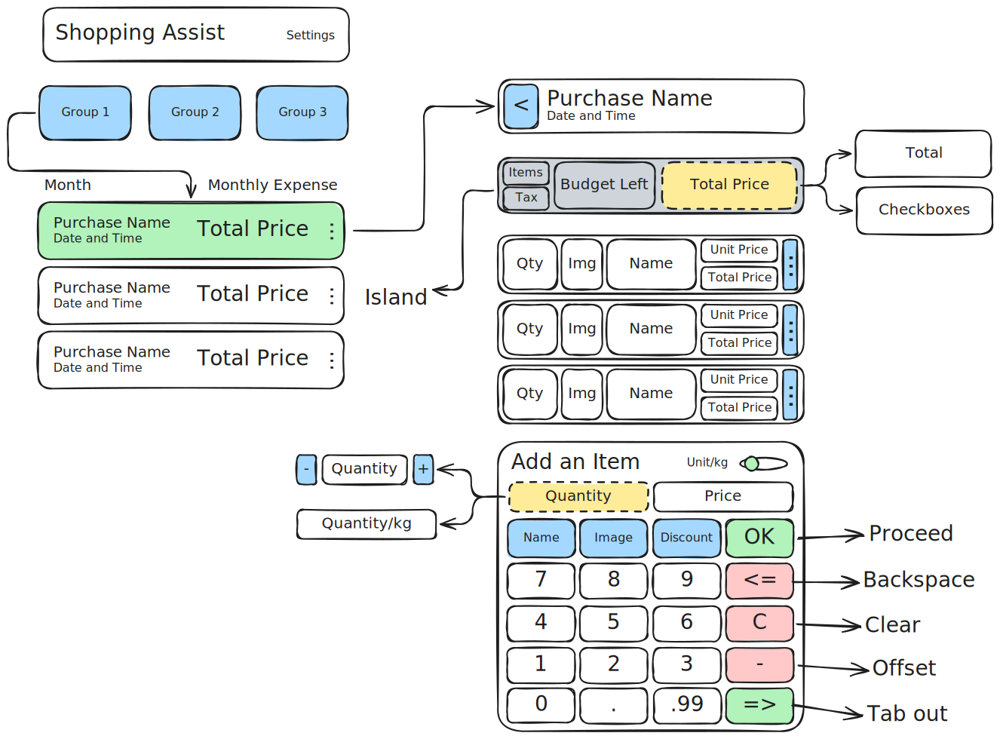

# Shopping Assist

A specialized tool for IRL shopping assistance

## Dev Snippets

On every DB change, run the following command:

```sh
dart run build_runner build
```

## Basic Requirements



### Settings Screen

Contains the following global settings:

- Set Currency Symbol
- Set Weight Unit (Metric, Imperial or Both)
- Set Tax Rate (0-100) for countries that display prices without tax

### Homepage Screen

- Contains a list of purchases
- Contains groups of purchases
- CRUD purchase groups
- CRUD purchase items

### Purchases Screen

- Contains a list of purchases in a group
- Purchase item has these attributes:
  - string name
  - datetime purchase_datetime
  - ref tax_rate
  - total_price (calc)

### Items Screen (Cart)

- Contains a list of items in a purchase
- CRUD items
- Item has these attributes:
  - string name
  - image photo
  - float discount
  - float quantity
  - float price

## Future Requirements

### Analytics

- Purchase history graph
- Price history graph for individual items
- Price history graph for all items timeline
- Monthly spend

### Imports and Exports

- Export to CSV
- Import from CSV
- Export to PDF

### QOL

- Item details autocompletion with Camera identification (tensorflow)
- Item duplication
- Item suggestions while typing based on history
- Easy price per item/quantity toggle
- Numpad type (top to bottom, bottom to top)
